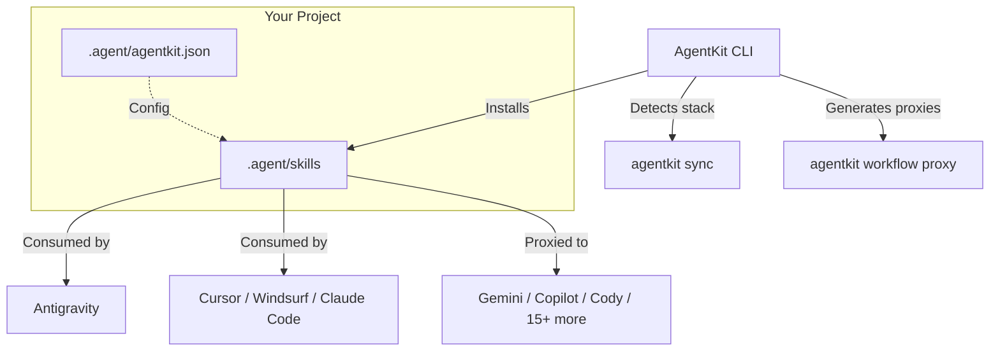

<div align="center">

<pre>
 █████╗  ██████╗ ███████╗███╗   ██╗████████╗██╗  ██╗██╗████████╗
██╔══██╗██╔════╝ ██╔════╝████╗  ██║╚══██╔══╝██║ ██╔╝██║╚══██╔══╝
███████║██║  ███╗█████╗  ██╔██╗ ██║   ██║   █████╔╝ ██║   ██║   
██╔══██║██║   ██║██╔══╝  ██║╚██╗██║   ██║   ██╔═██╗ ██║   ██║   
██║  ██║╚██████╔╝███████╗██║ ╚████║   ██║   ██║  ██╗██║   ██║   
╚═╝  ╚═╝ ╚═════╝ ╚══════╝╚═╝  ╚═══╝   ╚═╝   ╚═╝  ╚═╝╚═╝   ╚═╝   
</pre>

# @digimetalab/agentkit

**The Enterprise-Grade Skill Manager for AI Code Agents**

<p>
  <a href="https://www.npmjs.com/package/@digimetalab/agentkit"></a>
  <a href="https://nodejs.org"></a>
  <a href="https://www.npmjs.com/package/@digimetalab/agentkit"></a>
  <a href="https://github.com/digimetalab/agentkit"></a>
  <a href="https://opensource.org/licenses/MIT"></a>
</p>

<p>
  <a href="https://github.com/digimetalab/agentkit/graphs/commit-activity"></a>
  <a href="http://makeapullrequest.com"></a>
  <a href="https://standardjs.com"></a>
</p>

**211 Skills** · **5 Meta-Bundles** · **18 Platforms** · **Zero Lock-in**

</div>

---

## 📖 Table of Contents

- [Introduction](#-introduction)
- [Why AgentKit?](#-why-agentkit)
- [Architecture](#-architecture)
- [Quick Start](#-quick-start)
- [Meta-Bundles](#-meta-bundles)
- [Supported Platforms](#-supported-platforms)
- [CLI Reference](#-cli-reference)
- [Programmatic API](#-programmatic-api)
- [Project Structure](#-project-structure)
- [Documentation](#-documentation)
- [Contributing](#-contributing)
- [License](#-license)

---

## 📖 Introduction

**AgentKit** is a standardized infrastructure layer that transforms generic AI code assistants into specialized **Senior Engineering Partners**. 

Instead of relying on an AI's generalized training data—which often leads to hallucinated libraries, legacy patterns, or security flaws—AgentKit injects **211 battle-tested engineering skills** directly into your agent's context. 

These skills act as **Standard Operating Procedures (SOPs)**, ensuring your AI agent follows strict, production-ready guidelines for everything from React architecture to OWASP security audits, from RAG pipelines to growth marketing strategies.

---

## 💡 Why AgentKit?

| Feature | Without AgentKit | With AgentKit |
|---|---|---|
| **Context** | Generic, often outdated training data | **Project-specific context & latest best practices** |
| **Consistency** | Varies by prompt phrasing | **Deterministically follows engineering standards** |
| **Complex Tasks** | Often gets lost in multi-step tasks | **Follows strict step-by-step SOPs** |
| **Security** | Frequently suggests vulnerable code | **Includes automated security auditing skills** |
| **Onboarding** | Requires manual prompt engineering | **Instant specialized persona via Meta-Bundles** |
| **Platform** | Locked to one agent | **Works with 18 AI agents simultaneously** |

---

## 🏗️ Architecture

AgentKit uses a Universal Platform Architecture (UPA) — a single skill library that syncs across all your AI tools.



---

## 🚀 Quick Start

### 1. Installation

```bash
# Recommended — run without install
npx @digimetalab/agentkit

# Or install globally
npm install -g @digimetalab/agentkit
```

### 2. Interactive Setup

Run the command in your project root:

```bash
agentkit
```

The wizard will:
1. **Detect your project stack** (React, Node, Python, etc.)
2. **Select your AI agent** — Antigravity, Cursor, Windsurf, Claude Code, and 14 more.
3. **Choose a Meta-Bundle** — Foundation, Builder, Guardian, Brain, or Strategist.
4. **Install skills** to your agent's native directory.

### 3. Auto-Sync (Smart Install)

Let AgentKit detect your project stack and install the right skills automatically:

```bash
agentkit sync
```

This scans your `package.json`, `requirements.txt`, etc. and installs only the relevant skills for your tech stack.

### 4. Usage

Open your AI agent chat and work as usual. Your agent will automatically detect the installed skills and follow the engineering SOPs.

> *Example:* "Build a user dashboard with authentication."
> 
> Your agent now follows the React Patterns SOP, API Security Best Practices, and Authentication Flow guidelines — automatically.

---

## 📦 Meta-Bundles

AgentKit organizes 211 skills into **5 Meta-Bundles** — curated collections based on engineering role.

### 🟢 The Foundation (`foundation`)
*Architecture, Standards, & Documentation*

The bedrock skills every project needs. Clean code principles, Git workflows, architectural decision records, and documentation templates.

```bash
agentkit install --pack foundation
```

### 🔵 The Builder (`builder`)
*Frontend, Backend, & Infrastructure — 52 Skills*

Full-stack development SOPs. React/Vue/Svelte patterns, Node.js architecture, API design (REST/GraphQL), Docker containers, database design, Redis caching, serverless deployment, and more.

```bash
agentkit install --pack builder
```

### 🔴 The Guardian (`guardian`)
*Security, Quality, & Reliability — 34 Skills*

Defensive engineering. OWASP Top 10, penetration testing methodology, API security, performance profiling, code quality auditing, TDD workflows, and incident response procedures.

```bash
agentkit install --pack guardian
```

### 🟣 The Brain (`brain`)
*AI, Data, & Orchestration — 58 Skills*

AI engineering stack. Prompt engineering, RAG pipelines, LLM fine-tuning, multi-agent architecture, MCP server building, embeddings, vector search, computer vision, NLP, and ML operations.

```bash
agentkit install --pack brain
```

### 🟠 The Strategist (`strategist`)
*Product, Growth, & Content — 67 Skills*

Business and growth skills. SEO optimization, A/B testing, conversion rate optimization, content strategy, copywriting, paid ads, analytics tracking, ASO, and product management frameworks.

```bash
agentkit install --pack strategist
```

---

## 🔌 Supported Platforms

AgentKit supports **18 AI agent platforms** with native integration and automatic proxy generation.

| Agent | Type | Skills Path | Proxy Format |
|---|---|---|---|
| **Antigravity** | Native | `.agent/skills/` | `.md` |
| **Cursor** | IDE | `.cursor/rules/` | `.mdc` |
| **Windsurf** | IDE | `.agent/rules/` | `.md` |
| **Claude Code** | CLI | `.claude/skills/` | `.md` |
| **Gemini CLI** | CLI | `.gemini/skills/` | `.md` |
| **GitHub Copilot** | IDE | `.github/` | `copilot-instructions.md` |
| **Sourcegraph Cody** | IDE | `.github/` | `cody-instructions.md` |
| **Tabnine** | IDE | `.github/` | `tabnine-instructions.md` |
| **Codex CLI** | CLI | `.codex/skills/` | `.md` |
| **Trae** | IDE | `.trae/rules/` | `.md` |
| **Continue.dev** | IDE | `.continue/` | `config.json` |
| **Cline** | IDE | `.cline/rules/` | `.md` |
| **Aider** | CLI | `.` | `.aider.conf.yml` |
| **PearAI** | IDE | `.pearai/rules/` | `.md` |
| **Goose** | CLI | `.goose/skills/` | `.md` |
| **Void** | IDE | `.void/rules/` | `.md` |
| **OpenCode** | IDE | `.opencode/rules/` | `.md` |
| **Project IDX** | IDE | `.idx/skills/` | `.md` |

Generate proxy files for all your platforms at once:

```bash
agentkit workflow proxy
```

---

## 🛠️ CLI Reference

| Command | Arguments | Description |
|---|---|---|
| `agentkit` | *(none)* | Launch the interactive Setup Wizard. |
| `agentkit list` | `--skills` | List all Meta-Bundles. Use `--skills` to see all 211 skills. |
| `agentkit install` | `<skill>` | Install a single skill (e.g., `agentkit install react-best-practices`). |
| | `--pack <bundle>` | Install a Meta-Bundle (`foundation`, `builder`, `guardian`, `brain`, `strategist`). |
| | `--all` | Install the entire library (211 skills). |
| | `--out <path>` | Specify custom output directory (default: `./.agent/skills`). |
| `agentkit search` | `<query>` | Search for skills by keyword (e.g., `react`, `security`, `rag`). |
| `agentkit sync` | `--out <path>` | Auto-detect project stack and install matching skills. |
| `agentkit doctor` | `--fix` | Diagnose installation issues. Use `--fix` to auto-repair. |
| `agentkit status` | *(none)* | Show current installation status and detected agents. |
| `agentkit platform list` | *(none)* | List all 18 supported platforms and detection status. |
| `agentkit platform install` | `<name>` | Initialize configuration for a specific platform. |
| `agentkit platform sync` | *(none)* | Sync skills to all detected platforms. |
| `agentkit workflow proxy` | *(none)* | Generate platform-specific proxy files for installed skills. |
| `agentkit about` | *(none)* | Show AgentKit info and credits. |

---

## 💻 Programmatic API

Use AgentKit programmatically in your own Node.js tools.

```javascript
const agentkit = require('@digimetalab/agentkit');

// Install specific skills programmatically
await agentkit.commands.install('react-best-practices', { out: './my-skills' });

// List available bundles
const bundles = await agentkit.utils.getBundles();
console.log(bundles['builder']);
```

---

## 📁 Project Structure

When installed, AgentKit creates a non-intrusive structure in your project:

```
my-project/
├── .agent/                  # AgentKit Core Directory
│   ├── skills/              # Installed Skills (Markdown SOPs)
│   │   ├── react-best-practices/
│   │   ├── api-security-best-practices/
│   │   ├── prompt-engineering-master/
│   │   └── ... (211 skills available)
│   ├── workflows/           # Workflow Proxies
│   └── agentkit.json        # Configuration & Metadata
├── .cursor/rules/           # (If Cursor detected) Auto-generated proxies
├── .github/                 # (If Copilot/Cody) Instruction files
└── ...
```

---

## 📚 Documentation

Detailed documentation is available in the `docs/` directory:

| Document | Description |
|---|---|
| [Getting Started](docs/GETTING_STARTED.md) | Installation and first steps |
| [Skills Catalog](docs/SKILLS_CATALOG.md) | Full list of all 211 skills |
| [Bundles Guide](docs/BUNDLES.md) | Meta-Bundle details and selection guide |
| [Visual Guide](docs/VISUAL_GUIDE.md) | Visual walkthrough of features |
| [Skill Anatomy](docs/SKILL_ANATOMY.md) | How to write your own skills |
| [Examples](docs/EXAMPLES.md) | Practical usage scenarios |
| [FAQ](docs/FAQ.md) | Frequently Asked Questions |
| [Quality Bar](docs/QUALITY_BAR.md) | Skill validation standards |
| [Security Policy](docs/SECURITY.md) | Reporting vulnerabilities |
| [Security Guardrails](docs/SECURITY_GUARDRAILS.md) | Offensive skill usage policy |
| [Contributing](docs/CONTRIBUTING.md) | Contribution guidelines |
| [Changelog](docs/CHANGELOG.md) | Version history |

---

## 🤝 Contributing

We welcome contributions! Please see our [Contributing Guide](docs/CONTRIBUTING.md) for details.

1. Fork the repository.
2. Create your feature branch (`git checkout -b feature/amazing-skill`).
3. Follow the [Skill Anatomy](docs/SKILL_ANATOMY.md) guide for new skills.
4. Ensure your skill passes the [Quality Bar](docs/QUALITY_BAR.md).
5. Open a Pull Request.

---

## 📄 License

This project is licensed under the **MIT License**. See the [LICENSE](LICENSE) file for details.

---

<div align="center">

**Built with ❤️ for the AI Developer Community**  
*By [digimetalab](https://github.com/digimetalab)*

</div>
