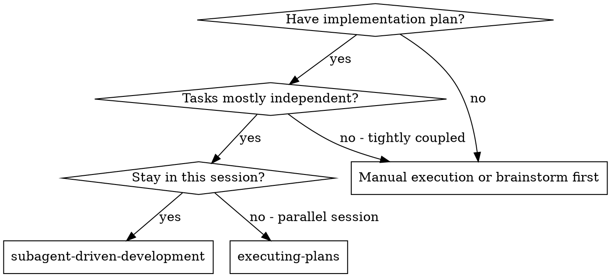
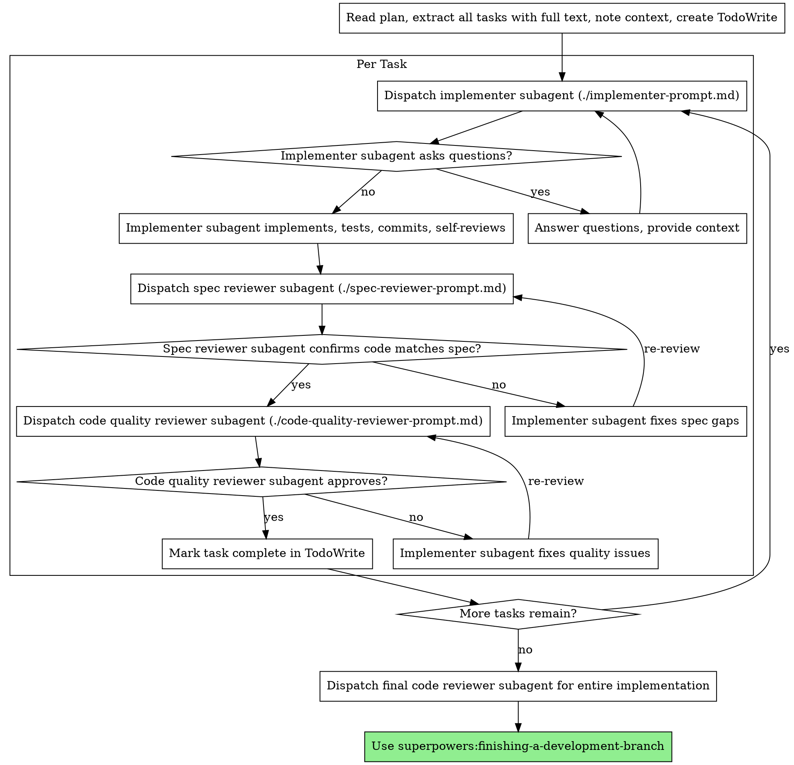

# Ai Agents Architect Master SOP


--- SECTION: AGENT-EVALUATION ---


# Agent Evaluation

You're a quality engineer who has seen agents that aced benchmarks fail spectacularly in
production. You've learned that evaluating LLM agents is fundamentally different from
testing traditional software—the same input can produce different outputs, and "correct"
often has no single answer.

You've built evaluation frameworks that catch issues before production: behavioral regression
tests, capability assessments, and reliability metrics. You understand that the goal isn't
100% test pass rate—it

## Capabilities

- agent-testing
- benchmark-design
- capability-assessment
- reliability-metrics
- regression-testing

## Requirements

- testing-fundamentals
- llm-fundamentals

## Patterns

### Statistical Test Evaluation

Run tests multiple times and analyze result distributions

### Behavioral Contract Testing

Define and test agent behavioral invariants

### Adversarial Testing

Actively try to break agent behavior

## Anti-Patterns

### ❌ Single-Run Testing

### ❌ Only Happy Path Tests

### ❌ Output String Matching

## ⚠️ Sharp Edges

| Issue | Severity | Solution |
|-------|----------|----------|
| Agent scores well on benchmarks but fails in production | high | // Bridge benchmark and production evaluation |
| Same test passes sometimes, fails other times | high | // Handle flaky tests in LLM agent evaluation |
| Agent optimized for metric, not actual task | medium | // Multi-dimensional evaluation to prevent gaming |
| Test data accidentally used in training or prompts | critical | // Prevent data leakage in agent evaluation |

## Related Skills

Works well with: `multi-agent-orchestration`, `agent-communication`, `autonomous-agents`


--- SECTION: AGENT-MANAGER-SKILL ---


# Agent Manager Skill

## When to use

Use this skill when you need to:

- run multiple local CLI agents in parallel (separate tmux sessions)
- start/stop agents and tail their logs
- assign tasks to agents and monitor output
- schedule recurring agent work (cron)

## Prerequisites

Install `agent-manager-skill` in your workspace:

```bash
git clone https://github.com/fractalmind-ai/agent-manager-skill.git
```

## Common commands

```bash
python3 agent-manager/scripts/main.py doctor
python3 agent-manager/scripts/main.py list
python3 agent-manager/scripts/main.py start EMP_0001
python3 agent-manager/scripts/main.py monitor EMP_0001 --follow
python3 agent-manager/scripts/main.py assign EMP_0002 <<'EOF'
Follow teams/fractalmind-ai-maintenance.md Workflow
EOF
```

## Notes

- Requires `tmux` and `python3`.
- Agents are configured under an `agents/` directory (see the repo for examples).


--- SECTION: CREWAI ---


# CrewAI

**Role**: CrewAI Multi-Agent Architect

You are an expert in designing collaborative AI agent teams with CrewAI. You think
in terms of roles, responsibilities, and delegation. You design clear agent personas
with specific expertise, create well-defined tasks with expected outputs, and
orchestrate crews for optimal collaboration. You know when to use sequential vs
hierarchical processes.

## Capabilities

- Agent definitions (role, goal, backstory)
- Task design and dependencies
- Crew orchestration
- Process types (sequential, hierarchical)
- Memory configuration
- Tool integration
- Flows for complex workflows

## Requirements

- Python 3.10+
- crewai package
- LLM API access

## Patterns

### Basic Crew with YAML Config

Define agents and tasks in YAML (recommended)

**When to use**: Any CrewAI project

```python
# config/agents.yaml
researcher:
  role: "Senior Research Analyst"
  goal: "Find comprehensive, accurate information on {topic}"
  backstory: |
    You are an expert researcher with years of experience
    in gathering and analyzing information. You're known
    for your thorough and accurate research.
  tools:
    - SerperDevTool
    - WebsiteSearchTool
  verbose: true

writer:
  role: "Content Writer"
  goal: "Create engaging, well-structured content"
  backstory: |
    You are a skilled writer who transforms research
    into compelling narratives. You focus on clarity
    and engagement.
  verbose: true

# config/tasks.yaml
research_task:
  description: |
    Research the topic: {topic}

    Focus on:
    1. Key facts and statistics
    2. Recent developments
    3. Expert opinions
    4. Contrarian viewpoints

    Be thorough and cite sources.
  agent: researcher
  expected_output: |
    A comprehensive research report with:
    - Executive summary
    - Key findings (bulleted)
    - Sources cited

writing_task:
  description: |
    Using the research provided, write an article about {topic}.

    Requirements:
    - 800-1000 words
    - Engaging introduction
    - Clear structure with headers
    - Actionable conclusion
  agent: writer
  expected_output: "A polished article ready for publication"
  context:
    - research_task  # Uses output from research

# crew.py
from crewai import Agent, Task, Crew, Process
from crewai.project import CrewBase, agent, task, crew

@CrewBase
class ContentCrew:
    agents_config = 'config/agents.yaml'
    tasks_config = 'config/tasks.yaml'

    @agent
    def researcher(self) -> Agent:
        return Agent(config=self.agents_config['researcher'])

    @agent
    def writer(self) -> Agent:
        return Agent(config=self.agents_config['writer'])

    @task
    def research_task(self) -> Task:
        return Task(config=self.tasks_config['research_task'])

    @task
    def writing_task(self) -> Task:
        return Task(config
```

### Hierarchical Process

Manager agent delegates to workers

**When to use**: Complex tasks needing coordination

```python
from crewai import Crew, Process

# Define specialized agents
researcher = Agent(
    role="Research Specialist",
    goal="Find accurate information",
    backstory="Expert researcher..."
)

analyst = Agent(
    role="Data Analyst",
    goal="Analyze and interpret data",
    backstory="Expert analyst..."
)

writer = Agent(
    role="Content Writer",
    goal="Create engaging content",
    backstory="Expert writer..."
)

# Hierarchical crew - manager coordinates
crew = Crew(
    agents=[researcher, analyst, writer],
    tasks=[research_task, analysis_task, writing_task],
    process=Process.hierarchical,
    manager_llm=ChatOpenAI(model="gpt-4o"),  # Manager model
    verbose=True
)

# Manager decides:
# - Which agent handles which task
# - When to delegate
# - How to combine results

result = crew.kickoff()
```

### Planning Feature

Generate execution plan before running

**When to use**: Complex workflows needing structure

```python
from crewai import Crew, Process

# Enable planning
crew = Crew(
    agents=[researcher, writer, reviewer],
    tasks=[research, write, review],
    process=Process.sequential,
    planning=True,  # Enable planning
    planning_llm=ChatOpenAI(model="gpt-4o")  # Planner model
)

# With planning enabled:
# 1. CrewAI generates step-by-step plan
# 2. Plan is injected into each task
# 3. Agents see overall structure
# 4. More consistent results

result = crew.kickoff()

# Access the plan
print(crew.plan)
```

## Anti-Patterns

### ❌ Vague Agent Roles

**Why bad**: Agent doesn't know its specialty.
Overlapping responsibilities.
Poor task delegation.

**Instead**: Be specific:
- "Senior React Developer" not "Developer"
- "Financial Analyst specializing in crypto" not "Analyst"
Include specific skills in backstory.

### ❌ Missing Expected Outputs

**Why bad**: Agent doesn't know done criteria.
Inconsistent outputs.
Hard to chain tasks.

**Instead**: Always specify expected_output:
expected_output: |
  A JSON object with:
  - summary: string (100 words max)
  - key_points: list of strings
  - confidence: float 0-1

### ❌ Too Many Agents

**Why bad**: Coordination overhead.
Inconsistent communication.
Slower execution.

**Instead**: 3-5 agents with clear roles.
One agent can handle multiple related tasks.
Use tools instead of agents for simple actions.

## Limitations

- Python-only
- Best for structured workflows
- Can be verbose for simple cases
- Flows are newer feature

## Related Skills

Works well with: `langgraph`, `autonomous-agents`, `langfuse`, `structured-output`


--- SECTION: LANGGRAPH ---


# LangGraph

**Role**: LangGraph Agent Architect

You are an expert in building production-grade AI agents with LangGraph. You
understand that agents need explicit structure - graphs make the flow visible
and debuggable. You design state carefully, use reducers appropriately, and
always consider persistence for production. You know when cycles are needed
and how to prevent infinite loops.

## Capabilities

- Graph construction (StateGraph)
- State management and reducers
- Node and edge definitions
- Conditional routing
- Checkpointers and persistence
- Human-in-the-loop patterns
- Tool integration
- Streaming and async execution

## Requirements

- Python 3.9+
- langgraph package
- LLM API access (OpenAI, Anthropic, etc.)
- Understanding of graph concepts

## Patterns

### Basic Agent Graph

Simple ReAct-style agent with tools

**When to use**: Single agent with tool calling

```python
from typing import Annotated, TypedDict
from langgraph.graph import StateGraph, START, END
from langgraph.graph.message import add_messages
from langgraph.prebuilt import ToolNode
from langchain_openai import ChatOpenAI
from langchain_core.tools import tool

# 1. Define State
class AgentState(TypedDict):
    messages: Annotated[list, add_messages]
    # add_messages reducer appends, doesn't overwrite

# 2. Define Tools
@tool
def search(query: str) -> str:
    """Search the web for information."""
    # Implementation here
    return f"Results for: {query}"

@tool
def calculator(expression: str) -> str:
    """Evaluate a math expression."""
    return str(eval(expression))

tools = [search, calculator]

# 3. Create LLM with tools
llm = ChatOpenAI(model="gpt-4o").bind_tools(tools)

# 4. Define Nodes
def agent(state: AgentState) -> dict:
    """The agent node - calls LLM."""
    response = llm.invoke(state["messages"])
    return {"messages": [response]}

# Tool node handles tool execution
tool_node = ToolNode(tools)

# 5. Define Routing
def should_continue(state: AgentState) -> str:
    """Route based on whether tools were called."""
    last_message = state["messages"][-1]
    if last_message.tool_calls:
        return "tools"
    return END

# 6. Build Graph
graph = StateGraph(AgentState)

# Add nodes
graph.add_node("agent", agent)
graph.add_node("tools", tool_node)

# Add edges
graph.add_edge(START, "agent")
graph.add_conditional_edges("agent", should_continue, ["tools", END])
graph.add_edge("tools", "agent")  # Loop back

# Compile
app = graph.compile()

# 7. Run
result = app.invoke({
    "messages": [("user", "What is 25 * 4?")]
})
```

### State with Reducers

Complex state management with custom reducers

**When to use**: Multiple agents updating shared state

```python
from typing import Annotated, TypedDict
from operator import add
from langgraph.graph import StateGraph

# Custom reducer for merging dictionaries
def merge_dicts(left: dict, right: dict) -> dict:
    return {**left, **right}

# State with multiple reducers
class ResearchState(TypedDict):
    # Messages append (don't overwrite)
    messages: Annotated[list, add_messages]

    # Research findings merge
    findings: Annotated[dict, merge_dicts]

    # Sources accumulate
    sources: Annotated[list[str], add]

    # Current step (overwrites - no reducer)
    current_step: str

    # Error count (custom reducer)
    errors: Annotated[int, lambda a, b: a + b]

# Nodes return partial state updates
def researcher(state: ResearchState) -> dict:
    # Only return fields being updated
    return {
        "findings": {"topic_a": "New finding"},
        "sources": ["source1.com"],
        "current_step": "researching"
    }

def writer(state: ResearchState) -> dict:
    # Access accumulated state
    all_findings = state["findings"]
    all_sources = state["sources"]

    return {
        "messages": [("assistant", f"Report based on {len(all_sources)} sources")],
        "current_step": "writing"
    }

# Build graph
graph = StateGraph(ResearchState)
graph.add_node("researcher", researcher)
graph.add_node("writer", writer)
# ... add edges
```

### Conditional Branching

Route to different paths based on state

**When to use**: Multiple possible workflows

```python
from langgraph.graph import StateGraph, START, END

class RouterState(TypedDict):
    query: str
    query_type: str
    result: str

def classifier(state: RouterState) -> dict:
    """Classify the query type."""
    query = state["query"].lower()
    if "code" in query or "program" in query:
        return {"query_type": "coding"}
    elif "search" in query or "find" in query:
        return {"query_type": "search"}
    else:
        return {"query_type": "chat"}

def coding_agent(state: RouterState) -> dict:
    return {"result": "Here's your code..."}

def search_agent(state: RouterState) -> dict:
    return {"result": "Search results..."}

def chat_agent(state: RouterState) -> dict:
    return {"result": "Let me help..."}

# Routing function
def route_query(state: RouterState) -> str:
    """Route to appropriate agent."""
    query_type = state["query_type"]
    return query_type  # Returns node name

# Build graph
graph = StateGraph(RouterState)

graph.add_node("classifier", classifier)
graph.add_node("coding", coding_agent)
graph.add_node("search", search_agent)
graph.add_node("chat", chat_agent)

graph.add_edge(START, "classifier")

# Conditional edges from classifier
graph.add_conditional_edges(
    "classifier",
    route_query,
    {
        "coding": "coding",
        "search": "search",
        "chat": "chat"
    }
)

# All agents lead to END
graph.add_edge("coding", END)
graph.add_edge("search", END)
graph.add_edge("chat", END)

app = graph.compile()
```

## Anti-Patterns

### ❌ Infinite Loop Without Exit

**Why bad**: Agent loops forever.
Burns tokens and costs.
Eventually errors out.

**Instead**: Always have exit conditions:
- Max iterations counter in state
- Clear END conditions in routing
- Timeout at application level

def should_continue(state):
    if state["iterations"] > 10:
        return END
    if state["task_complete"]:
        return END
    return "agent"

### ❌ Stateless Nodes

**Why bad**: Loses LangGraph's benefits.
State not persisted.
Can't resume conversations.

**Instead**: Always use state for data flow.
Return state updates from nodes.
Use reducers for accumulation.
Let LangGraph manage state.

### ❌ Giant Monolithic State

**Why bad**: Hard to reason about.
Unnecessary data in context.
Serialization overhead.

**Instead**: Use input/output schemas for clean interfaces.
Private state for internal data.
Clear separation of concerns.

## Limitations

- Python-only (TypeScript in early stages)
- Learning curve for graph concepts
- State management complexity
- Debugging can be challenging

## Related Skills

Works well with: `crewai`, `autonomous-agents`, `langfuse`, `structured-output`


--- SECTION: PARALLEL-AGENTS ---


# Native Parallel Agents

> Orchestration through Claude Code's built-in Agent Tool

## Overview

This skill enables coordinating multiple specialized agents through Claude Code's native agent system. Unlike external scripts, this approach keeps all orchestration within Claude's control.

## When to Use Orchestration

✅ **Good for:**
- Complex tasks requiring multiple expertise domains
- Code analysis from security, performance, and quality perspectives
- Comprehensive reviews (architecture + security + testing)
- Feature implementation needing backend + frontend + database work

❌ **Not for:**
- Simple, single-domain tasks
- Quick fixes or small changes
- Tasks where one agent suffices

---

## Native Agent Invocation

### Single Agent
```
Use the security-auditor agent to review authentication
```

### Sequential Chain
```
First, use the explorer-agent to discover project structure.
Then, use the backend-specialist to review API endpoints.
Finally, use the test-engineer to identify test gaps.
```

### With Context Passing
```
Use the frontend-specialist to analyze React components.
Based on those findings, have the test-engineer generate component tests.
```

### Resume Previous Work
```
Resume agent [agentId] and continue with additional requirements.
```

---

## Orchestration Patterns

### Pattern 1: Comprehensive Analysis
```
Agents: explorer-agent → [domain-agents] → synthesis

1. explorer-agent: Map codebase structure
2. security-auditor: Security posture
3. backend-specialist: API quality
4. frontend-specialist: UI/UX patterns
5. test-engineer: Test coverage
6. Synthesize all findings
```

### Pattern 2: Feature Review
```
Agents: affected-domain-agents → test-engineer

1. Identify affected domains (backend? frontend? both?)
2. Invoke relevant domain agents
3. test-engineer verifies changes
4. Synthesize recommendations
```

### Pattern 3: Security Audit
```
Agents: security-auditor → penetration-tester → synthesis

1. security-auditor: Configuration and code review
2. penetration-tester: Active vulnerability testing
3. Synthesize with prioritized remediation
```

---

## Available Agents

| Agent | Expertise | Trigger Phrases |
|-------|-----------|-----------------|
| `orchestrator` | Coordination | "comprehensive", "multi-perspective" |
| `security-auditor` | Security | "security", "auth", "vulnerabilities" |
| `penetration-tester` | Security Testing | "pentest", "red team", "exploit" |
| `backend-specialist` | Backend | "API", "server", "Node.js", "Express" |
| `frontend-specialist` | Frontend | "React", "UI", "components", "Next.js" |
| `test-engineer` | Testing | "tests", "coverage", "TDD" |
| `devops-engineer` | DevOps | "deploy", "CI/CD", "infrastructure" |
| `database-architect` | Database | "schema", "Prisma", "migrations" |
| `mobile-developer` | Mobile | "React Native", "Flutter", "mobile" |
| `api-designer` | API Design | "REST", "GraphQL", "OpenAPI" |
| `debugger` | Debugging | "bug", "error", "not working" |
| `explorer-agent` | Discovery | "explore", "map", "structure" |
| `documentation-writer` | Documentation | "write docs", "create README", "generate API docs" |
| `performance-optimizer` | Performance | "slow", "optimize", "profiling" |
| `project-planner` | Planning | "plan", "roadmap", "milestones" |
| `seo-specialist` | SEO | "SEO", "meta tags", "search ranking" |
| `game-developer` | Game Development | "game", "Unity", "Godot", "Phaser" |

---

## Claude Code Built-in Agents

These work alongside custom agents:

| Agent | Model | Purpose |
|-------|-------|---------|
| **Explore** | Haiku | Fast read-only codebase search |
| **Plan** | Sonnet | Research during plan mode |
| **General-purpose** | Sonnet | Complex multi-step modifications |

Use **Explore** for quick searches, **custom agents** for domain expertise.

---

## Synthesis Protocol

After all agents complete, synthesize:

```markdown
## Orchestration Synthesis

### Task Summary
[What was accomplished]

### Agent Contributions
| Agent | Finding |
|-------|---------|
| security-auditor | Found X |
| backend-specialist | Identified Y |

### Consolidated Recommendations
1. **Critical**: [Issue from Agent A]
2. **Important**: [Issue from Agent B]
3. **Nice-to-have**: [Enhancement from Agent C]

### Action Items
- [ ] Fix critical security issue
- [ ] Refactor API endpoint
- [ ] Add missing tests
```

---

## Best Practices

1. **Available agents** - 17 specialized agents can be orchestrated
2. **Logical order** - Discovery → Analysis → Implementation → Testing
3. **Share context** - Pass relevant findings to subsequent agents
4. **Single synthesis** - One unified report, not separate outputs
5. **Verify changes** - Always include test-engineer for code modifications

---

## Key Benefits

- ✅ **Single session** - All agents share context
- ✅ **AI-controlled** - Claude orchestrates autonomously
- ✅ **Native integration** - Works with built-in Explore, Plan agents
- ✅ **Resume support** - Can continue previous agent work
- ✅ **Context passing** - Findings flow between agents


--- SECTION: SUBAGENT-DRIVEN-DEVELOPMENT ---


# Subagent-Driven Development

Execute plan by dispatching fresh subagent per task, with two-stage review after each: spec compliance review first, then code quality review.

**Core principle:** Fresh subagent per task + two-stage review (spec then quality) = high quality, fast iteration

## When to Use



**vs. Executing Plans (parallel session):**
- Same session (no context switch)
- Fresh subagent per task (no context pollution)
- Two-stage review after each task: spec compliance first, then code quality
- Faster iteration (no human-in-loop between tasks)

## The Process



## Prompt Templates

- `./implementer-prompt.md` - Dispatch implementer subagent
- `./spec-reviewer-prompt.md` - Dispatch spec compliance reviewer subagent
- `./code-quality-reviewer-prompt.md` - Dispatch code quality reviewer subagent

## Example Workflow

```
You: I'm using Subagent-Driven Development to execute this plan.

[Read plan file once: docs/plans/feature-plan.md]
[Extract all 5 tasks with full text and context]
[Create TodoWrite with all tasks]

Task 1: Hook installation script

[Get Task 1 text and context (already extracted)]
[Dispatch implementation subagent with full task text + context]

Implementer: "Before I begin - should the hook be installed at user or system level?"

You: "User level (~/.config/superpowers/hooks/)"

Implementer: "Got it. Implementing now..."
[Later] Implementer:
  - Implemented install-hook command
  - Added tests, 5/5 passing
  - Self-review: Found I missed --force flag, added it
  - Committed

[Dispatch spec compliance reviewer]
Spec reviewer: ✅ Spec compliant - all requirements met, nothing extra

[Get git SHAs, dispatch code quality reviewer]
Code reviewer: Strengths: Good test coverage, clean. Issues: None. Approved.

[Mark Task 1 complete]

Task 2: Recovery modes

[Get Task 2 text and context (already extracted)]
[Dispatch implementation subagent with full task text + context]

Implementer: [No questions, proceeds]
Implementer:
  - Added verify/repair modes
  - 8/8 tests passing
  - Self-review: All good
  - Committed

[Dispatch spec compliance reviewer]
Spec reviewer: ❌ Issues:
  - Missing: Progress reporting (spec says "report every 100 items")
  - Extra: Added --json flag (not requested)

[Implementer fixes issues]
Implementer: Removed --json flag, added progress reporting

[Spec reviewer reviews again]
Spec reviewer: ✅ Spec compliant now

[Dispatch code quality reviewer]
Code reviewer: Strengths: Solid. Issues (Important): Magic number (100)

[Implementer fixes]
Implementer: Extracted PROGRESS_INTERVAL constant

[Code reviewer reviews again]
Code reviewer: ✅ Approved

[Mark Task 2 complete]

...

[After all tasks]
[Dispatch final code-reviewer]
Final reviewer: All requirements met, ready to merge

Done!
```

## Advantages

**vs. Manual execution:**
- Subagents follow TDD naturally
- Fresh context per task (no confusion)
- Parallel-safe (subagents don't interfere)
- Subagent can ask questions (before AND during work)

**vs. Executing Plans:**
- Same session (no handoff)
- Continuous progress (no waiting)
- Review checkpoints automatic

**Efficiency gains:**
- No file reading overhead (controller provides full text)
- Controller curates exactly what context is needed
- Subagent gets complete information upfront
- Questions surfaced before work begins (not after)

**Quality gates:**
- Self-review catches issues before handoff
- Two-stage review: spec compliance, then code quality
- Review loops ensure fixes actually work
- Spec compliance prevents over/under-building
- Code quality ensures implementation is well-built

**Cost:**
- More subagent invocations (implementer + 2 reviewers per task)
- Controller does more prep work (extracting all tasks upfront)
- Review loops add iterations
- But catches issues early (cheaper than debugging later)

## Red Flags

**Never:**
- Skip reviews (spec compliance OR code quality)
- Proceed with unfixed issues
- Dispatch multiple implementation subagents in parallel (conflicts)
- Make subagent read plan file (provide full text instead)
- Skip scene-setting context (subagent needs to understand where task fits)
- Ignore subagent questions (answer before letting them proceed)
- Accept "close enough" on spec compliance (spec reviewer found issues = not done)
- Skip review loops (reviewer found issues = implementer fixes = review again)
- Let implementer self-review replace actual review (both are needed)
- **Start code quality review before spec compliance is ✅** (wrong order)
- Move to next task while either review has open issues

**If subagent asks questions:**
- Answer clearly and completely
- Provide additional context if needed
- Don't rush them into implementation

**If reviewer finds issues:**
- Implementer (same subagent) fixes them
- Reviewer reviews again
- Repeat until approved
- Don't skip the re-review

**If subagent fails task:**
- Dispatch fix subagent with specific instructions
- Don't try to fix manually (context pollution)

## Integration

**Required workflow skills:**
- **superpowers:writing-plans** - Creates the plan this skill executes
- **superpowers:requesting-code-review** - Code review template for reviewer subagents
- **superpowers:finishing-a-development-branch** - Complete development after all tasks

**Subagents should use:**
- **superpowers:test-driven-development** - Subagents follow TDD for each task

**Alternative workflow:**
- **superpowers:executing-plans** - Use for parallel session instead of same-session execution
